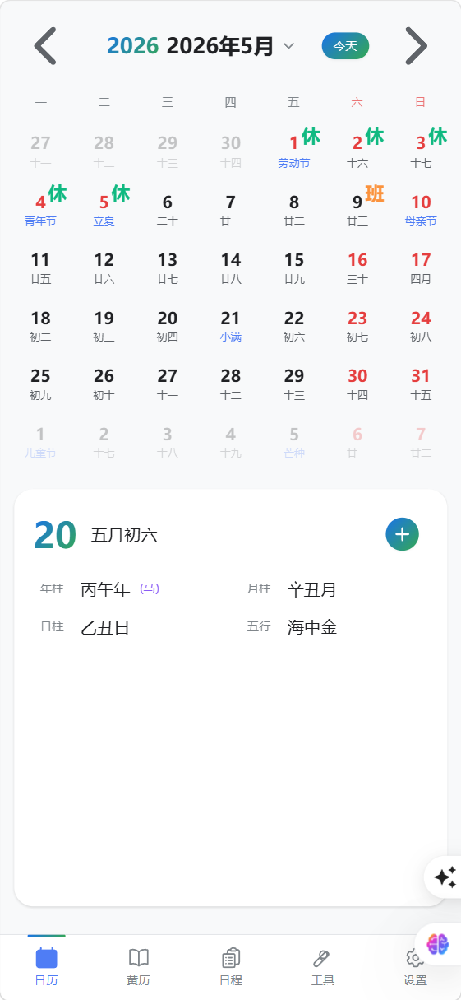
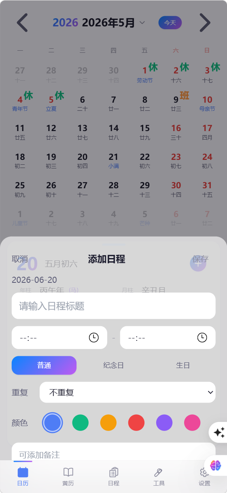

# 万年历 · WanNianLi

> 一款融合传统历法与现代美学的离线日历 App
> A modern calendar app with the wisdom of Chinese tradition.

[](https://github.com/yourname/wan-nian-li/releases)
[](LICENSE)
[](https://dist-ten-psi-35.vercel.app/)
[](#ios)
[](#android)

[简体中文](#简体中文) · [English](#english)

---

## 简体中文

### 项目简介

**万年历** 是一款融合中国传统文化与现代设计的离线日历应用。公历、农历、老黄历三历合一，节日节气一目了然，日程管理本地存储保护隐私。

### 核心功能

| 功能 | 说明 |
|---|---|
| 📅 **三历合一** | 公历、农历、老黄历同步显示 |
| 🏮 **节日节气** | 24 节气、传统节日、农历纪念日自动标注 |
| 📜 **黄历宜忌** | 每日宜、忌、吉神、凶煞查询 |
| 🐲 **干支生肖** | 年柱、月柱、日柱、十二生肖 |
| 📝 **日程管理** | 标题/时间/地点/备注/重复/类型 |
| 🎨 **6 套主题** | 经典 / iOS 26 / Google / 海岛 / 太极 / 禅意 |
| 🌗 **深浅模式** | 浅色 / 深色 / 跟随时间 / 跟随系统 |
| 🌍 **中英双语** | 智能检测浏览器语言 |
| 📱 **PWA 离线** | 安装到主屏，断网可用 |
| ♿ **Apple HIG** | 44pt 触控目标 / 安全区域 |

### 截图

| 月历视图 | 日详情 | 主题切换 |
|---|---|---|
|  |  |  |

### 技术栈

- **核心**：React 18 · TypeScript · Vite 5
- **UI**：TailwindCSS 3.4 · 6 套自定义主题
- **状态**：Zustand 5 · TanStack Query 5
- **存储**：IndexedDB（Dexie.js 4）
- **路由**：React Router 6
- **i18n**：react-i18next 24 · i18next 23
- **PWA**：vite-plugin-pwa（Workbox）
- **原生壳**：Capacitor 8（iOS / Android）
- **代码规范**：ESLint 9 · TypeScript ESLint

### 快速开始

```bash
# 克隆仓库
git clone https://github.com/yourname/wan-nian-li.git
cd wan-nian-li

# 安装依赖（需要 Node.js 20+）
npm install

# 启动开发服务器
npm run dev
# 访问 http://localhost:3000

# 类型检查
npx tsc --noEmit

# 构建生产版本
npm run build
```

### 项目结构

```
wan-nian-li/
├── src/
│   ├── app/              # 应用入口（路由 / 布局）
│   ├── pages/            # 页面组件
│   │   ├── CalendarPage/ # 日历（5 个子组件）
│   │   ├── AlmanacPage/  # 黄历
│   │   ├── SchedulePage/ # 日程
│   │   ├── ToolsPage/    # 日期工具
│   │   └── SettingsPage/ # 设置
│   ├── components/       # 公共组件
│   │   └── SwipeToDelete.tsx
│   ├── core/             # 核心算法
│   │   ├── lunar/        # 农历 / 节气 / 干支
│   │   ├── almanac/      # 黄历
│   │   └── date-tools/   # 日期工具
│   ├── stores/           # Zustand stores
│   ├── styles/           # 全局样式
│   ├── hooks/            # 自定义 hooks
│   ├── i18n/             # 多语言（zh-CN / en）
│   └── utils/            # 工具函数
├── public/               # 静态资源（含 PWA manifest）
├── docs/                 # 项目文档
├── android/              # Capacitor Android 工程
├── ios/                  # Capacitor iOS 工程（需在 Mac 上生成）
├── resources/            # 图标 / 启动屏
├── capacitor.config.ts   # Capacitor 配置
├── vite.config.ts        # Vite + PWA 配置
└── tailwind.config.ts    # Tailwind 主题配置
```

### 部署

#### Web（PWA）→ Vercel

```bash
# 第一次部署
cd dist
vercel deploy --prod --yes -t $VERCEL_TOKEN
```

#### iOS（需 Mac + Xcode 15+）

参见 [docs/ios-deploy-guide.md](docs/ios-deploy-guide.md)

```bash
npx cap add ios          # 首次
npx cap sync ios
npx cap open ios
# Xcode → Product → Archive → Distribute App
```

#### Android

参见 [docs/android-signing-guide.md](docs/android-signing-guide.md)

```bash
npx cap sync android
cd android && ./gradlew bundleRelease
# 产物：app/build/outputs/bundle/release/app-release.aab
```

### 文档

| 文档 | 用途 |
|---|---|
| [docs/app-store-listing.md](docs/app-store-listing.md) | App Store 上架文案（描述 / 截图规范 / 隐私标签） |
| [docs/ios-deploy-guide.md](docs/ios-deploy-guide.md) | iOS 上架完整操作手册 |
| [docs/android-signing-guide.md](docs/android-signing-guide.md) | Android 签名 + Google Play 上架 |
| [Privacy Policy](https://dist-ten-psi-35.vercel.app/privacy.html) | 隐私政策 |
| [Support](https://dist-ten-psi-35.vercel.app/support.html) | 技术支持 / FAQ |
| [EULA](https://dist-ten-psi-35.vercel.app/eula.html) | 最终用户许可协议 |
| [Changelog](https://dist-ten-psi-35.vercel.app/changelog.html) | 更新日志 |

### 路线图

- [x] 公历 + 农历 + 黄历三历合一
- [x] 6 套主题
- [x] 中英双语
- [x] PWA 离线支持
- [x] 滑动切换月份
- [x] Apple HIG 合规
- [ ] iCloud 同步
- [ ] 本地通知提醒
- [ ] 月相显示
- [ ] 桌面小组件
- [ ] 农历/黄历英文翻译（当前保留中文）

### 隐私承诺

✅ **不收集任何用户数据**
✅ 所有日程/偏好仅保存在设备本地
✅ 无广告 / 无第三方追踪
✅ 完全离线工作

详见 [隐私政策](https://dist-ten-psi-35.vercel.app/privacy.html)。

### License

[MIT](LICENSE) © 2025 万年历

### 联系方式

- 邮箱：11137533@qq.com
- 应用内反馈：设置 → 关于 → 意见反馈

---

## English

### Introduction

**WanNianLi** is an offline calendar app that blends traditional Chinese timekeeping with modern aesthetics. Solar, lunar, and almanac in one place. Festivals and solar terms at a glance. Schedule management with full local data privacy.

### Features

| Feature | Description |
|---|---|
| 📅 **Three Calendars** | Solar, lunar, and almanac in sync |
| 🏮 **Festivals & Solar Terms** | 24 solar terms, traditional holidays, lunar anniversaries |
| 📜 **Daily Almanac** | Auspicious / Inauspicious activities, deities, conflicts |
| 🐲 **Stem-Branch & Zodiac** | Year/Month/Day pillars + 12 Chinese zodiac |
| 📝 **Schedule Management** | Title / time / location / notes / repeat / type |
| 🎨 **6 Themes** | Classic / iOS 26 / Google / Island / Taiji / Zen |
| 🌗 **Dark / Light** | Light / Dark / Auto-by-time / Follow-system |
| 🌍 **i18n** | Auto-detects browser language (zh-CN / English) |
| 📱 **PWA Offline** | Installable, works without network |
| ♿ **Apple HIG** | 44pt touch targets, safe area aware |

### Tech Stack

- **Core**: React 18 · TypeScript · Vite 5
- **UI**: TailwindCSS 3.4 · 6 custom themes
- **State**: Zustand 5 · TanStack Query 5
- **Storage**: IndexedDB via Dexie.js 4
- **Routing**: React Router 6
- **i18n**: react-i18next
- **PWA**: vite-plugin-pwa (Workbox)
- **Native**: Capacitor 8 (iOS / Android)

### Quick Start

```bash
git clone https://github.com/yourname/wan-nian-li.git
cd wan-nian-li
npm install
npm run dev
# Open http://localhost:3000

npm run build  # production
```

### Deployment

#### Web (PWA) → Vercel

```bash
cd dist
vercel deploy --prod --yes -t $VERCEL_TOKEN
```

#### iOS (requires Mac + Xcode 15+)

See [docs/ios-deploy-guide.md](docs/ios-deploy-guide.md)

#### Android

See [docs/android-signing-guide.md](docs/android-signing-guide.md)

### Documentation

- [App Store Listing](docs/app-store-listing.md) - Description, screenshots spec, privacy labels
- [iOS Deploy Guide](docs/ios-deploy-guide.md) - iOS submission walkthrough
- [Android Signing](docs/android-signing-guide.md) - Keystore + Google Play
- [Privacy Policy](https://dist-ten-psi-35.vercel.app/privacy.html)
- [Support / FAQ](https://dist-ten-psi-35.vercel.app/support.html)
- [EULA](https://dist-ten-psi-35.vercel.app/eula.html)
- [Changelog](https://dist-ten-psi-35.vercel.app/changelog.html)

### Roadmap

- [x] Solar + Lunar + Almanac
- [x] 6 themes
- [x] i18n (zh-CN / en)
- [x] PWA offline
- [x] Swipe month navigation
- [x] Apple HIG compliant
- [ ] iCloud sync
- [ ] Local notifications
- [ ] Moon phase
- [ ] Home screen widget
- [ ] Almanac English translation

### Privacy

✅ No data collection
✅ All data stored locally on device
✅ No ads, no third-party tracking
✅ Fully offline

### License

[MIT](LICENSE) © 2025 WanNianLi

### Contact

- Email: 11137533@qq.com
- In-app feedback: Settings → About → Send feedback
